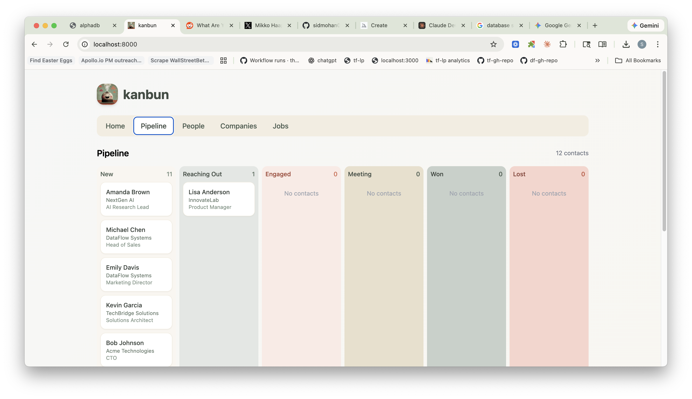

# kanbun

A lightweight lead enrichment and CRM tool with Kanban pipeline management. Upload a CSV of companies/contacts, enrich with website data and screenshots, then track your outreach through a drag-and-drop pipeline.



## Features

- **CSV Import**: Upload company/contact lists from Apollo, LinkedIn exports, etc.
- **Website Enrichment**: Scrape company websites using Firecrawl for descriptions, metadata, and more
- **Screenshot Capture**: Automatic homepage screenshots using Playwright Firefox
- **Kanban Pipeline**: Drag-and-drop contacts through stages: New → Reaching Out → Engaged → Meeting → Won/Lost
- **Outreach Tracking**: Log emails and LinkedIn messages, view outreach history
- **Reminders**: Set follow-up reminders with due dates
- **Email Integration**: One-click email templates that open in your email client

## Quick Start

### Prerequisites

- Python 3.11+
- [Anthropic API key](https://console.anthropic.com/) (required)
- [Firecrawl API key](https://www.firecrawl.dev/) (optional, for enrichment)

### Setup

1. Clone the repository:
   ```bash
   git clone https://github.com/sidmohan0/kanbun.git
   cd kanbun
   ```

2. Create a virtual environment and install dependencies:
   ```bash
   python -m venv venv
   source venv/bin/activate  # On Windows: venv\Scripts\activate
   pip install -r requirements.txt
   ```

3. Install Playwright browser:
   ```bash
   playwright install firefox
   ```

4. Configure environment variables:
   ```bash
   cp .env.example .env
   # Edit .env with your API keys
   ```

5. Run the application:
   ```bash
   uvicorn app.main:app --reload
   ```

6. Open http://localhost:8000 in your browser

### Docker Setup

Alternatively, use Docker Compose:

```bash
# Set your API keys
export ANTHROPIC_API_KEY=your-key
export FIRECRAWL_API_KEY=your-key

# Run
docker compose up --build
```

## Usage

1. **Import Contacts**: On the Home tab, upload a CSV file. Use `sample-data.csv` to test.
2. **Enrich Companies**: Jobs run automatically to scrape website data and capture screenshots.
3. **Manage Pipeline**: Go to the Pipeline tab to see contacts in a Kanban board. Drag cards between columns.
4. **Track Outreach**: Click a contact card to open details. Log emails/LinkedIn messages, add reminders.
5. **Send Emails**: Click "Email" to open a pre-filled email in your default client.

## CSV Format

Required columns:
- `company_name` (or `company name`, `company`)
- `website` (or `website_url`, `url`)

Optional columns:
- `company linkedin url`
- `first_name`, `last_name`, `email`, `phone`, `title`
- `person linkedin url`

## Tech Stack

- **Backend**: FastAPI, SQLite (aiosqlite), Python 3.11
- **Frontend**: Vanilla JavaScript, Tailwind CSS
- **Screenshot Service**: Playwright with Firefox
- **Enrichment**: Firecrawl API

## Project Structure

```
kanbun/
├── app/
│   ├── main.py              # FastAPI routes
│   ├── config.py            # Settings/environment
│   ├── database.py          # SQLite schema
│   ├── models.py            # Pydantic models
│   ├── services/
│   │   ├── csv_parser.py    # CSV import logic
│   │   ├── job_processor.py # Background job processing
│   │   ├── screenshot_service.py
│   │   └── ...
│   └── static/
│       └── index.html       # Single-page frontend
├── data/                    # SQLite DB, screenshots (gitignored)
├── sample-data.csv          # Demo data for testing
├── requirements.txt
├── Dockerfile
└── docker-compose.yml
```

## License

MIT
